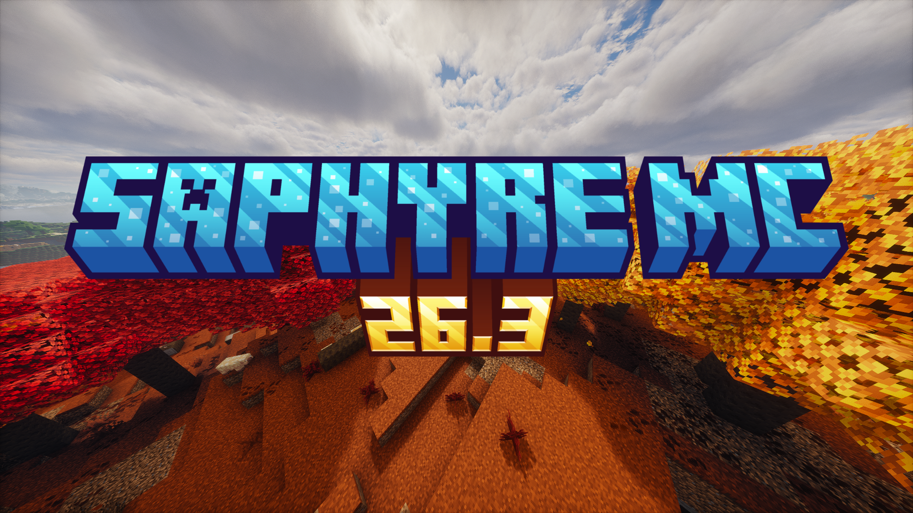

<h1 align="center">Saphyre MC</h1>

  

    A lightweight, vanilla-friendly Minecraft modpack focused on performance, quality-of-life improvements, and keeping the original Minecraft feel.
  

  
   
   
  
  &nbsp;&nbsp;&nbsp;
  

## About

**Saphyre MC** is a vanilla-friendly modpack designed to make Minecraft feel a little nicer while staying close to the original experience.

The goal is simple: improve performance, smooth out small annoyances, and add useful quality-of-life features without turning Minecraft into a completely different game.

## Features

- Lightweight and optimization-focused;
- Vanilla-friendly gameplay with minimal changes to the core experience;
- Quality-of-life improvements for everyday play;
- Versions are maintained mainly on Modrinth as updates become available.

## Installation

You can install **Saphyre MC** in several ways.

The `.mrpack` file can be downloaded directly from the Modrinth website or from the GitHub `versions/` folder. After downloading it, import the file into any launcher that supports Modrinth modpacks.

You can also use the official Modrinth launcher. Install the Modrinth App on your PC, search for **Saphyre MC**, select the version you want, and download it directly through the launcher.

> Important: Always make sure the modpack version matches the Minecraft version you intend to play, especially when joining a specific server or using a specific map.

## Compatibility

**Saphyre MC** is distributed only for **Minecraft: Java Edition** and uses **Fabric**.

The supported Minecraft versions change over time, with newer Minecraft releases being supported as the modpack is updated.

## Notes

Feel free to use **Saphyre MC** as a base for your own modpack, but please **give proper credit to everyone involved.**

**Shaders** have been removed from newer versions of the modpack, although some older versions still include them. Some shaders take too long to receive updates, so I decided to leave them out.

The **performance versions** have also been discontinued because many of their mods do not receive frequent updates, making it difficult to keep each release consistent.

*Based on [Simply Optimized](https://modrinth.com/modpack/sop) by [HyperSoop](https://modrinth.com/user/HyperSoop) in past versions.*

## Reporting issues

Found a bug or compatibility problem? Open an issue in the project's GitHub repository and be as specific and detailed as possible about the problem.

## License

**Saphyre MC** is licensed under **[CC-BY-SA-4.0.](https://creativecommons.org/licenses/by/4.0/)** Individual mods and assets included in the modpack may use different licenses. Check their respective project pages for details.
